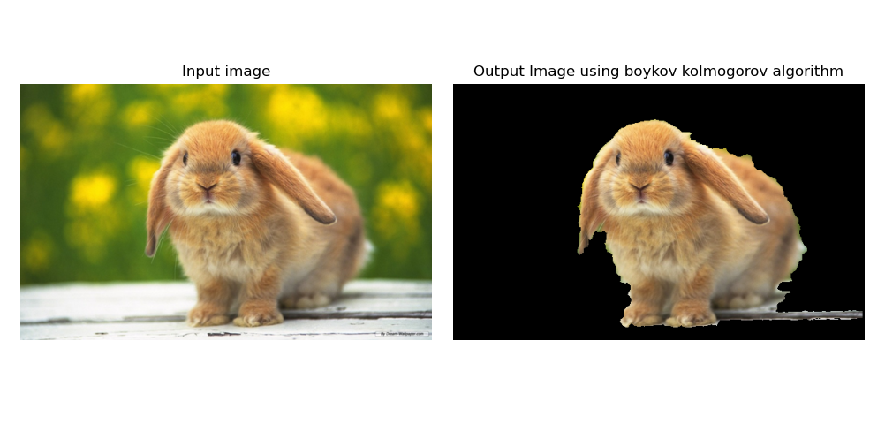
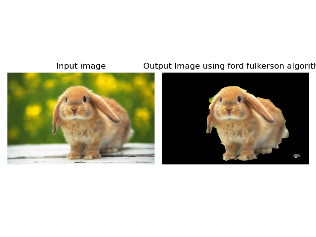

## Project Description:

Advanced algorithm design and analysis course assignment
The idea of maximum flow and minimum cut set is used to segment the image

## Dependencies:
require python 3.8

All dependencies are enlisted in requirements.txt
	
	pip install -r requirements.txt	

**Note:**

Extension need not be png
	
**Runtime Commands**

**fast_seg.py**
The main code used to produce the segmentation results. command-line arguments
1. **-i / --img** : -i <path to input image>
2. **-a / --algo** : values “bk”/”ff”
-  **“bk”** - used to perform segmentation using boykov kolmogorov algorithm
-  **“ff”** - used to perform segmentation using ford fulkerson algorithm

**Example:** python fast_seg.py -i ./images/bunny.png -a bk

## Instructions
Press the "o" key on your keyboard to start marking an object.
Press the "b" key on your keyboard to start marking the background.
When you have finished marking, press the esc key on your keyboard
Marking process, can be roughly marked, only need to draw part of the line

## Results 

